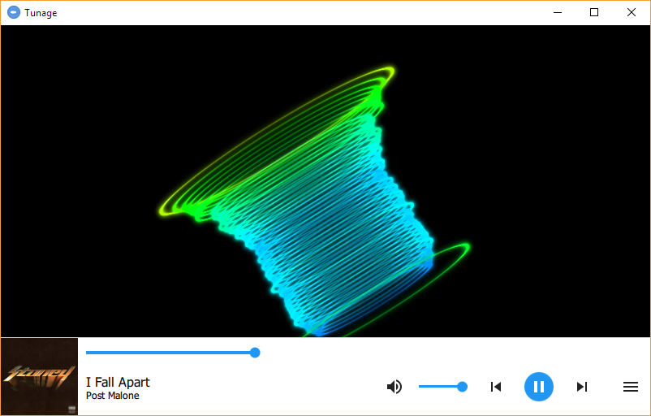

# Tunage [![travis.badge]][travis.link]
A cross-platform media player that supports visualizing audio through GLSL shaders.
The project is inspired by WMP and Winamp visualizers and is aimed to bring that experience to multiple platforms.

    

Project is at it's early stages and everyone is welcome to contribute!

# Features
- Cross-platform
- Basic audio codec support
- Basic media player functionality like media controls and playlist
- QML-based interface
- GLSL shaders for music visualization

# Building
For building Tunage you need OpenGL, Qt 5.11, CMake 3.10 and either MSVC 15.9 or GCC 8.
Depending on the platform, you may also need ALSA/ASIO/WASAPI. Other external libraries are included in the source.

# License
This project is licensed under the GNU GPL v3.0+ - see the LICENSE.md file for details.

# Acknowledgements
Tunage uses the following libraries aside from Qt:

- [PortAudio](http://www.portaudio.com/)
- [libnyquist](https://github.com/ddiakopoulos/libnyquist)
- [KissFFT](https://github.com/mborgerding/kissfft)
- [TagLib](https://github.com/taglib/taglib)
- [CTPL](https://github.com/vit-vit/CTPL)

[travis.badge]: https://travis-ci.com/sanchaez/tunage.svg?branch=master
[travis.link]: https://travis-ci.com/sanchaez/tunage